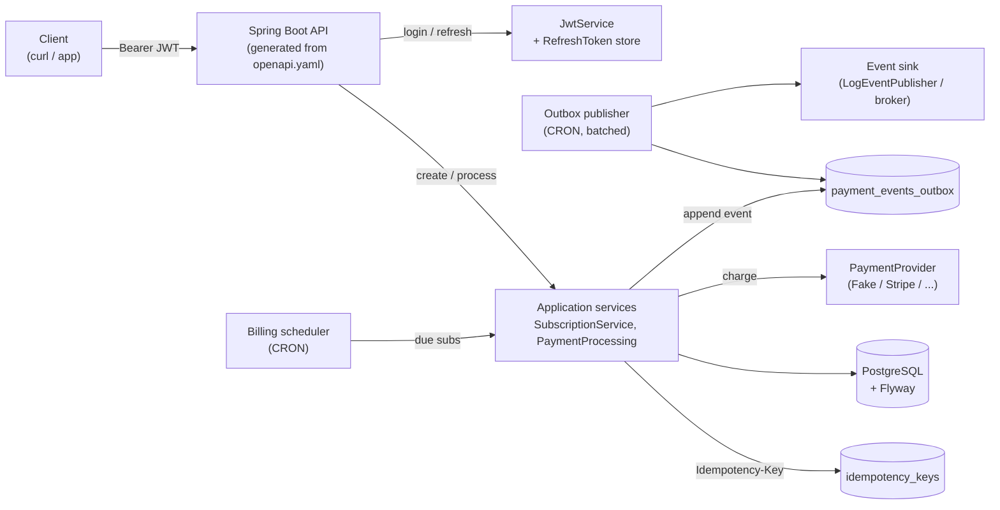

<div align="center">

# Recurring Payments API

**Self-hosted backend for subscriptions and recurring payments.**
Schema-first REST API. Scheduled billing. Reliable event delivery via Outbox.
JWT auth with rotating refresh. Idempotent writes you can replay safely.

[](https://openjdk.org/projects/jdk/21/)
[](https://spring.io/projects/spring-boot)
[](https://www.postgresql.org/)
[](https://flywaydb.org/)
[](https://www.openapis.org/)
[](https://jwt.io/)
[](https://www.quartz-scheduler.org/)
[](https://testcontainers.com/)
[](https://docs.docker.com/compose/)
[](#status)

</div>

---

## What it is

A small, **opinionated** recurring-payments service you can run yourself.

- Create a subscription — the API persists it, computes `nextChargeDate`, and the billing scheduler charges it when it's due.
- Every payment attempt goes through a `PaymentProvider` port (a fake provider ships by default; swap in Stripe behind the same interface).
- Every state change emits an event into an **Outbox** table; a separate publisher scheduler drains it in batches — no lost events on broker failure.
- Write endpoints accept an `Idempotency-Key` header. Same key + same fingerprint → response replay. Same key + different body → `409`.
- Auth is **JWT access token** in the response body + **rotating refresh token** in an HttpOnly cookie. Owner vs `ADMIN` scoping enforced at the controller.

It is **not** a hosted SaaS. It is **not** a PSP. It is the smallest stack — one Postgres, one app — that lets you build a subscription product without re-inventing scheduling, event delivery, and idempotency every time.

## Architecture



## Project layout

```
recurring-payments-api/
├── src/main/java/com/lukaszszumiec/recurring_payments_api/
│   ├── api/                    REST controllers implementing generated OpenAPI interfaces
│   │   └── mapper/             MapStruct: domain <-> generated DTOs
│   ├── application/            Use-cases (services), commands, principal
│   │   └── impl/               Service implementations
│   ├── config/                 Security, JWT/Billing properties, static OpenAPI
│   ├── domain/
│   │   ├── model/              User, Subscription, Payment, OutboxEvent, RefreshToken, IdempotencyKey
│   │   └── port/               Repository ports (hexagonal seams)
│   └── infrastructure/
│       ├── adapter/            JPA adapters implementing domain ports
│       ├── provider/           PaymentProvider port + FakePaymentProvider
│       ├── publisher/          EventPublisher port + LogEventPublisher
│       ├── scheduler/          PaymentScheduler (billing), OutboxPublisher
│       └── security/           JwtService, JwtAuthFilter
├── src/main/resources/
│   ├── db/migration/           Flyway SQL (V1__init.sql, V2__idempotency.sql)
│   ├── openapi.yaml            API contract — source of truth
│   └── application.yml         Spring config (cron, JWT, datasource)
├── docker/postgres/seed/       Seed SQL (default dev user)
├── docker-compose.yml          db + app + db-seed
├── Dockerfile                  App image
└── pom.xml                     Build + OpenAPI generator + MapStruct
```

## Quick start

> Requires: Docker, Docker Compose.

```bash
# 1. Build images (app + seed)
docker compose build

# 2. Boot the full stack
docker compose up -d

# 3. Tail logs
docker compose logs -f app

# 4. Check that the seed completed
docker compose logs -f db-seed
```

Once up:

- App        → `http://localhost:8080/`
- Swagger UI → `http://localhost:8080/swagger-ui/index.html`
- OpenAPI    → `http://localhost:8080/v3/api-docs`

Tear down:

```bash
docker compose down              # stop
docker compose down -v           # stop + wipe DB volumes (resets users, subs, payments)
```

> Rebuilding after a code change: `docker compose build app && docker compose up -d`

### Seed user (DEV only)

- Email: `admin@local`
- Password: `password`

## API

All endpoints sit under `/api` and (except `/api/auth/login` and `/api/auth/refresh`) require an `Authorization: Bearer <access-token>` header.

| Method | Path                                       | Purpose                                                          |
|--------|--------------------------------------------|------------------------------------------------------------------|
| POST   | `/api/auth/login`                          | Access token in body, refresh token in HttpOnly cookie           |
| POST   | `/api/auth/refresh`                        | Rotate refresh cookie, return new access token                   |
| POST   | `/api/auth/logout`                         | Revoke refresh, clear cookie                                     |
| GET    | `/api/auth/me`                             | Current principal                                                |
| GET    | `/api/subscriptions`                       | List (owner sees own; `ADMIN` sees all)                          |
| GET    | `/api/subscriptions/{id}`                  | Details (owner or `ADMIN`)                                       |
| POST   | `/api/subscriptions`                       | Create — **supports `Idempotency-Key`**                          |
| POST   | `/api/subscriptions/{id}/process`          | Run billing now — **supports `Idempotency-Key`**                 |
| GET    | `/api/users/{userId}/payments?page=&size=` | Paginated payments (owner or `ADMIN`)                            |

**Create subscription request body:**

```json
{
  "userId": 1,
  "price": "19.99",
  "billingDayOfMonth": 15
}
```

**Payment response (shape):**

```json
{
  "id": 42,
  "subscriptionId": 7,
  "amount": "19.99",
  "status": "SUCCESS",
  "createdAt": "2026-05-26T12:00:00Z"
}
```

### Example cURL

```bash
# 1. Login (form-encoded; refresh token lands in the cookie jar)
curl -s -c cookies.txt -X POST http://localhost:8080/api/auth/login \
  -H "Content-Type: application/x-www-form-urlencoded" \
  --data "email=admin@local&password=password"
# => {"accessToken":"<JWT>","expiresIn":3600}

ACCESS="<paste JWT here>"

# 2. Create a subscription (idempotent)
curl -s -X POST http://localhost:8080/api/subscriptions \
  -H "Authorization: Bearer $ACCESS" \
  -H "Idempotency-Key: sub-create-123" \
  -H "Content-Type: application/json" \
  -d '{"userId":1,"price":"19.99","billingDayOfMonth":15}'

# 3. Force a charge now
curl -s -X POST http://localhost:8080/api/subscriptions/1/process \
  -H "Authorization: Bearer $ACCESS" \
  -H "Idempotency-Key: sub-1-process-2026-05-26"

# 4. List payments
curl -s "http://localhost:8080/api/users/1/payments?page=0&size=20" \
  -H "Authorization: Bearer $ACCESS"

# 5. Rotate the access token
curl -s -b cookies.txt -c cookies.txt -X POST http://localhost:8080/api/auth/refresh
```

## Configuration

`application.yml` (and matching `SPRING_*` env vars in `docker-compose.yml`):

| Key                                | Default                                         | Notes                                            |
|------------------------------------|-------------------------------------------------|--------------------------------------------------|
| `spring.datasource.url`            | `jdbc:postgresql://db:5432/recurring`           | Override with `SPRING_DATASOURCE_URL`            |
| `spring.datasource.username`       | `recurring`                                     | `SPRING_DATASOURCE_USERNAME`                     |
| `spring.datasource.password`       | `recurring`                                     | `SPRING_DATASOURCE_PASSWORD`                     |
| `spring.jpa.hibernate.ddl-auto`    | `validate`                                      | Schema owned by Flyway, not Hibernate            |
| `spring.flyway.locations`          | `classpath:db/migration`                        | `V1__init.sql`, `V2__idempotency.sql`            |
| `jwt.secret`                       | dev-only secret                                 | **Rotate for prod** — HMAC key                   |
| `jwt.expiration`                   | `3600`                                          | Access token TTL (seconds)                       |
| `jwt.refresh-expiration`           | `1209600`                                       | Refresh token TTL (seconds) — 14 days            |
| `billing.charge-cron`              | `0 * * * * *`                                   | Billing scheduler cron (Quartz syntax)           |
| `outbox.publish-cron`              | `*/15 * * * * *`                                | Outbox publisher cron                            |
| `outbox.batch-size`                | `100`                                           | Max events per publisher tick                    |

Notes:

- Schema is owned by Flyway. `ddl-auto: validate` will fail fast if entities drift from migrations — that is intentional.
- The Outbox publisher updates each row from `PENDING` → `SENT` / `FAILED`; no events are lost if the consumer is briefly down.

## Domain details

- **Subscriptions** — `userId`, `price`, `billingDayOfMonth`, `nextChargeDate`. The billing scheduler picks rows where `nextChargeDate <= today` and hands them to `PaymentProcessingService`.
- **Payments** — go `PENDING → SUCCESS | FAILED` via the `PaymentProvider` port. After a `SUCCESS`, the subscription's `nextChargeDate` advances by one month.
- **Outbox** — every payment transition appends a row to `payment_events_outbox` in the **same transaction** as the state change. A separate scheduled publisher drains it.
- **Idempotency** — `idempotency_keys` stores `key + fingerprint(method, path, normalized body) + response`. Replays return the original response; conflicting bodies return `409 Conflict`.
- **Auth** — login issues an access JWT + a rotating refresh token persisted in `refresh_tokens` and set as an HttpOnly cookie. `/refresh` revokes the old row and issues a new one.

## Testing

- `spring-boot-starter-test` for slices and full-context tests.
- **Testcontainers + PostgreSQL** for repository integration tests (`*IT.java`), backed by `AbstractIntegrationTest` and `application-test.yml`.

Run everything:

```bash
./mvnw verify
```

Covered today:

- Subscription, Payment, User, RefreshToken, Outbox repository adapters against a real Postgres.
- Application context boot.

## Status

MVP. Single fake `PaymentProvider`, single broker-less publisher, single-tenant. Roadmap:

| Area              | Next                                                                |
|-------------------|---------------------------------------------------------------------|
| Payments          | Real PSP (Stripe) behind `PaymentProvider`, webhook signatures      |
| Outbox            | Retry with backoff + DLQ after N failures                           |
| Observability     | Micrometer metrics, OpenTelemetry traces, structured access log     |
| Security          | Per-tenant scoping, secret-manager-backed JWT key, refresh reuse detection |
| API               | Cancel / pause subscription, proration, multi-currency              |
| Ops               | Rate limiting, audit log for admin actions                          |

## Design principles

- **Hexagonal seams where they earn their keep.** `domain/port/*` and `PaymentProvider` / `EventPublisher` are real ports because they have plausible second implementations (Stripe, Kafka). The rest is straight Spring — no abstraction for abstraction's sake.
- **Schema is the contract.** `openapi.yaml` is the source of truth; controllers implement generated interfaces, and MapStruct keeps domain and DTOs separate.
- **Transactions own correctness.** Payment state and the matching outbox row are written in the same transaction — no event without a state change, no state change without an event.
- **Idempotency is per-write, not per-call.** Fingerprinting the body means accidental retries replay; mismatched retries fail loudly with `409`.
- **Stable interfaces, replaceable internals.** The fake `PaymentProvider` and `LogEventPublisher` are deliberate — they keep the seams honest and the dev loop hermetic.

## Troubleshooting

- `Flyway validation failed` on startup → entity drift vs. migrations. Add a new `V*__*.sql`; do not edit applied migrations.
- `401` on every call → access token expired. Hit `/api/auth/refresh` (needs the cookie) to get a new one.
- `409 Conflict` on retry → you reused an `Idempotency-Key` with a different body. Use a new key, or send the original body.
- Billing not firing → check `billing.charge-cron` and that `nextChargeDate` for your subscription is actually `<= today`.
- Outbox rows stuck `PENDING` → check `OutboxPublisher` logs; events stay queued until the publisher succeeds, by design.

## License

MIT.
